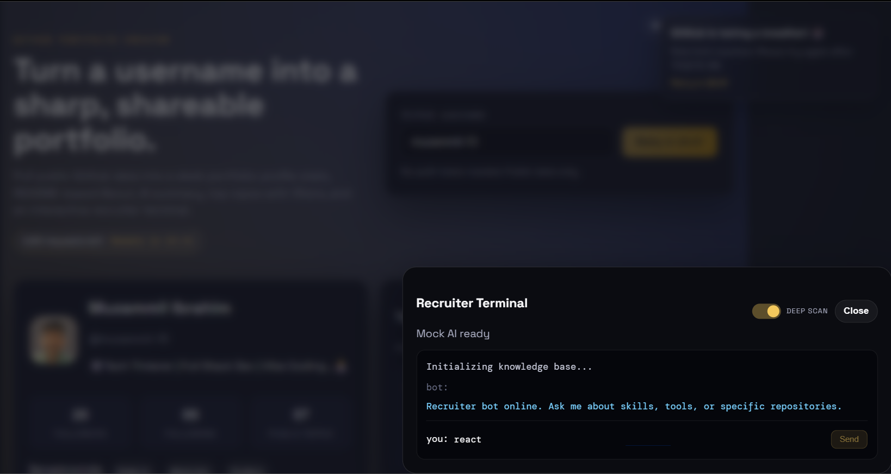

# ⚡️ GitHub Portfolio Creator

> Turn a GitHub username into a sharp, shareable portfolio in seconds.

This app transforms public GitHub data into a high‑fidelity, recruiter‑ready portfolio. It includes a recruiter bot (mock AI), deep‑scan knowledge base, smart filters, and export options.

---

## ✨ Key Features

* **🧠 Intelligent Parsing**: Extracts profile stats, bio, and README‑based About.
* **🤖 AI Summary**: Generates a concise technical snapshot from public data.
* **🧪 Recruiter Bot (Mock AI)**: Floating action button opens a draggable terminal‑style chat.
* **🧠 Knowledge Base**: Built from repo descriptions + READMEs.
* **🔍 Deep Scan Toggle**: Analyze the full repository library for richer context.
* **🎯 Smart Filtering**: Filter top repos by Stars, Activity, or Forks.
* **📦 Share & Export**:
  * **PNG Snapshot**
  * **Recruiter PDF**
  * **Standalone ZIP (static HTML/CSS + data)**
* **🚦 Rate‑Limit Shield**: Live API status, countdown, and disabled submit on cooldown.

---

## 🛠 Tech Stack

| Category           | Tools                                                 |
| :----------------- | :---------------------------------------------------- |
| **Frontend** | React + TypeScript + Vite                             |
| **Styling**  | Custom CSS (Dark Theme)                               |
| **API**      | GitHub REST API                                       |
| **Exports**  | `html2canvas`, `jsPDF`, `JSZip`, `file-saver` |

---

## 🚀 Getting Started

```bash
npm install
```

```bash
npm run dev
```

```bash
npm run build
```

---

## 📸 Screenshots




## 🎥 Demo


---

## 💡 Notes

* **No Auth Required**: Uses public GitHub endpoints only.
* **Rate Limits**: The UI shows remaining requests and a countdown on limit hits.
* **Deep Scan**: Loads all repos into the knowledge base (can be slower and hit rate limits faster).

---

## 🏆 Credits

Built for the **MakeSomething Workshop**.
